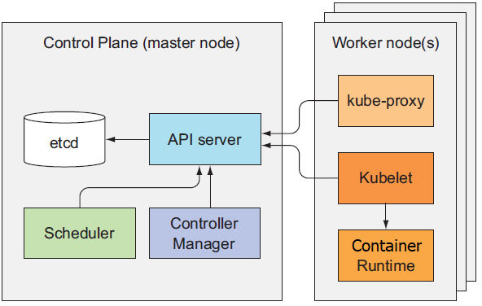

# Intro
--

## Components

## Pods

- A pod is the smallest deployable unit of an application in Kubernetes
- Pod is not same as container
- Each pod can run one or more containers
- All containers running in a same pod share all system resources like
  * IP address
  * Network Port range
  * IPC space
  * Volumes

- Container running in pod can talk to each other using localhost
- Pods are **ephemeral** , Pod can die or terminate and start new one by kubernete

## ReplicaSets

- ReplicaSet is one level above PODs in its hierarchy
- It controls pods 
- Replica set has a defined number of pods that needs to be running, If one of the pods fails or dies, the replication controller will start a new pod in its place
- It is responsible for ensuring that a specified number of copies of a given pod are running 

## Deployment

- Deployment sits above a replica set and can manipulate them
- Container image can not be upgraded (eg: Nginx:1.20 -> 1.23) or rollbacked with out downtime, if deployed using Pod or ReplicaSet 
- Deployment controller does it in rolling fashion

## Services

- Service provide connectivity to pod from outside world, expose endpoint running in pod to outside world
- Service is a network abstraction over a set of pods
- This allows for the traffic to be load balanced for failures

**Types**
  - ClusterIP:
        * Helps to expose a endpoit to all pods rinning in the cluster.
        * Pod A run mongoDB, Pod B run application,  pod B can access mongoDB endpoint running on pod A, if exposed using cluster IP
  - NodePort
        * Cluster IP is accesible with in cluster
        * This can not be accessed from the node running the pod
        * Each node in the cluster will expose a port with same number that will be forwared to clusterIP
  - Loadbalancer
   

